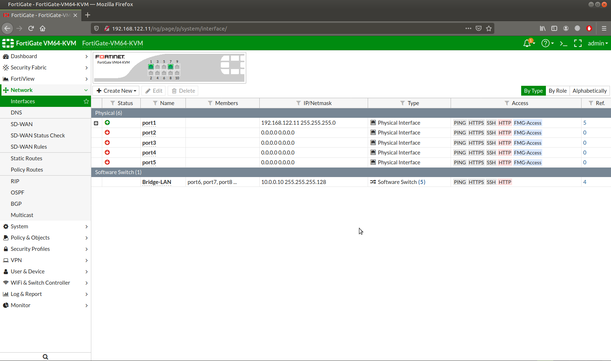
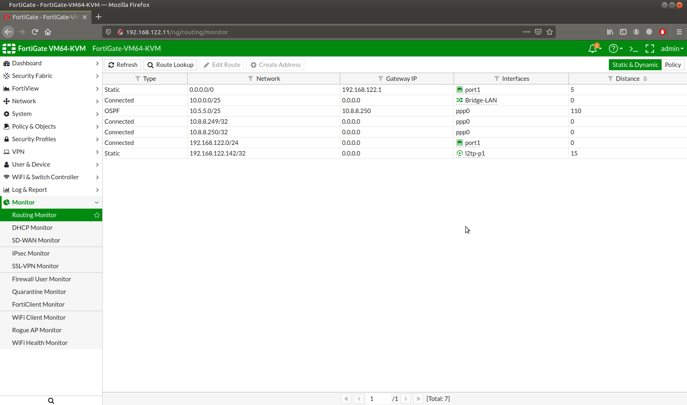
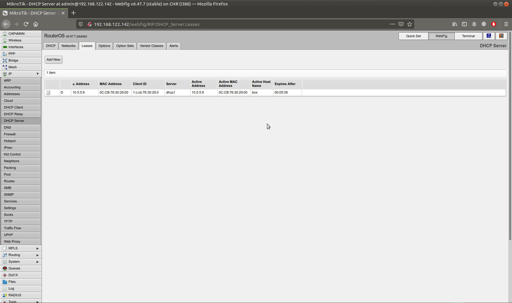
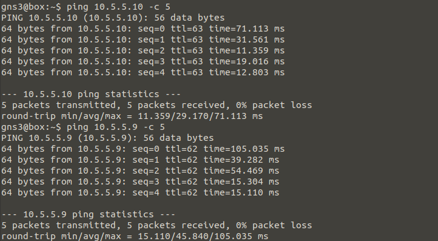

# MikroTik X FortiGate: IPSec Tunnel

## IPSec (Internet Protocol Security) Tunnel configuration with MikroTik router and FortiGate/Fortinet router.

### IPSec Tunnel L2TP network scheme


### Configure IPSec tunnel L2TP server router (FortiGate)
```
# Router interface LAN
config system switch-interface
edit "Bridge-LAN"
set vdom "root"
set member "port6" "port7" "port8" "port9" "port10"
next
end
config system interface
edit "Bridge-LAN"
set vdom "root"
set ip 10.0.0.10 255.255.255.128
set allowaccess ping https ssh http
set role lan
next
end

# dhcp server LAN
config system dhcp server
edit 1
set dns-service default
set default-gateway 10.0.0.10
set netmask 255.255.255.128
set interface "Bridge-LAN"
config ip-range
edit 1
set start-ip 10.0.0.1
set end-ip 10.0.0.9
next
edit 2
set start-ip 10.0.0.11
set end-ip 10.0.0.126
next
end
next
end

# Router interface out internet
config system interface
edit "port1"
set vdom "root"
set mode dhcp
set allowaccess ping https ssh http fgfm
set role wan
next
edit "port2"
set vdom "root"
set allowaccess ping https ssh http fgfm
set role wan
next
edit "port3"
set vdom "root"
set allowaccess ping https ssh http fgfm
set role wan
next
edit "port4"
set vdom "root"
set allowaccess ping https ssh http fgfm
set role wan
next
edit "port5"
set vdom "root"
set allowaccess ping https ssh http fgfm
set role wan
next
end

# Firewall internet access
config firewall policy
edit 1
set name "INSIDE - OUTSIDE"
set srcintf "Bridge-LAN"
set dstintf "port1"
set srcaddr "all"
set dstaddr "all"
set action accept
set schedule "always"
set service "ALL"
set nat enable
next
end

# Configure IPSec Tunnel L2TP
# user and group L2TP
config user local
edit "user"
set type password
set passwd “user”
next
end
config user group
edit "l2tp-group"
set member "user"
next
end

# L2TP
config vpn l2tp
set eip 10.8.8.254
set sip 10.8.8.249
set status enable
set usrgrp "l2tp-group"
end

# IPSec phase1-interface
config vpn ipsec phase1-interface
edit "l2tp-p1"
set type dynamic
set interface "port1"
set peertype any
set proposal des-sha512
set dhgrp 2
set psksecret “123456”
next
end

# IPSec phase2-interface
config vpn ipsec phase2-interface
edit "l2tp-p2"
set phase1name "l2tp-p1"
set proposal des-sha512
set pfs disable
set encapsulation transport-mode
set l2tp enable
next
end

# Firewall IPSec Tunnel L2TP server-client
config firewall policy
edit 2
set name "l2tp policy 1"
set srcintf "l2tp-p1"
set dstintf "port1"
set srcaddr "all"
set dstaddr "all"
set action accept
set schedule "always"
set service "L2TP"
next
edit 3
set name "ipsec policy"
set srcintf "l2tp-p1"
set dstintf "Bridge-LAN"
set srcaddr "all"
set dstaddr "all"
set action accept
set schedule "always"
set service "ALL"
next
edit 4
set name "l2tp policy 2"
set srcintf "Bridge-LAN"
set dstintf "l2tp-p1"
set srcaddr "all"
set dstaddr "all"
set action accept
set schedule "always"
set service "ALL"
set nat enable
next
end

# Configure OSPF LAN L2TP server-client
config router ospf
set router-id 10.0.0.10
config area
edit 0.0.0.0
next
end
config network
edit 2
set prefix 10.0.0.0 255.255.255.128
next
edit 1
set prefix 10.8.8.248 255.255.255.248
next
end
config redistribute "connected"
set status enable
set metric 20
end
config redistribute "static"
set status enable
set metric 20
end
end

```
### Verify configurations IPSec tunnel L2TP server router (FortiGate)






### Configure IPSec tunnel L2TP client router (MikroTik)
```
# Router ip address
/ip address add address=10.5.5.10/25 interface=ether4 network=10.5.5.0
# ip dhcp server pool
/ip pool add name=dhcp_pool0 ranges=10.5.5.1-10.5.5.9,10.5.5.11-10.5.5.126
# dhcp server
/ip dhcp-server add address-pool=dhcp_pool0 disabled=no interface=ether4 name=dhcp1
/ip dhcp-server network add address=10.5.5.0/25 gateway=10.5.5.10
# Configure internet access all clients
# Interface out internet access
/ip dhcp-client add disabled=no interface=ether1
# Clients allow remote requests
/ip dns set allow-remote-requests=yes
# NAT
/ip firewall nat add action=masquerade chain=srcnat out-interface=ether1
# Configure IPSec Tunnel L2TP
# IPSec Profile
/ip ipsec profile set [ find default=yes ] dh-group=modp1024 enc-algorithm=des hash-algorithm=sha512
# IPSec Proposal
/ip ipsec proposal set [ find default=yes ] auth-algorithms=sha512 enc-algorithms=des pfs-group=none
# L2TP profile
/ppp profile add name=l2tp use-encryption=yes
# Create connection L2TP
/interface l2tp-client add connect-to=192.168.122.11 disabled=no ipsec-secret=123456 keepalive-timeout=disabled name=l2tp-out1 password=user profile=l2tp use-ipsec=yes user=user
# Configure OSPF LAN L2TP server-client
/routing ospf network add area=backbone network=10.8.8.248/29 add area=backbone network=10.5.5.0/25
```
### Verify configurations IPSec tunnel L2TP client router (MikroTik)




### Verify configurations client LAN L2TP Server




### Verify configurations client LAN L2TP Client


** **

**NOTE:**<br>
NAT node is allows to connect a topology to internet via NAT. By default, NAT node runs a DHCP server with a predefined pool in the 122.0/24 range.<br>
Inter-vlan configuration 1 router port dot1Q mode with 1 switch port trunk mode and others switch port access mode.<br>
Tools<br>
FortiGate ipsec phase1-interface equal to MikroTik ipsec profile<br>
FortiGate ipsec phase2-interface equal to MikroTik ipsec proposal<br>
Reference for IPSec Diffie-Hellman groups (dhgrp or dh-group) [here](https://help.mikrotik.com/docs/display/ROS/IPsec#IPsec-Diffie-HellmanGroups).<br>
GNS3 version 2.2.15<br>
FortiGate-VM64-KVM v5.6.1 build1484 (Qemu VM)<br>
MikroTik RouterOS 6.47.7 (Qemu VM)<br>
Linux 3.16.6-tinycore (Qemu VM)<br>
Host<br>
Ubuntu Release 20.04.2 LTS (Focal Fossa) 64-bit Kernel Linux 5.4.0-1032-raspi aarch64 MATE 1.24.0<br>
Raspberry Pi 4 ARM 64-bit 4GB RAM
